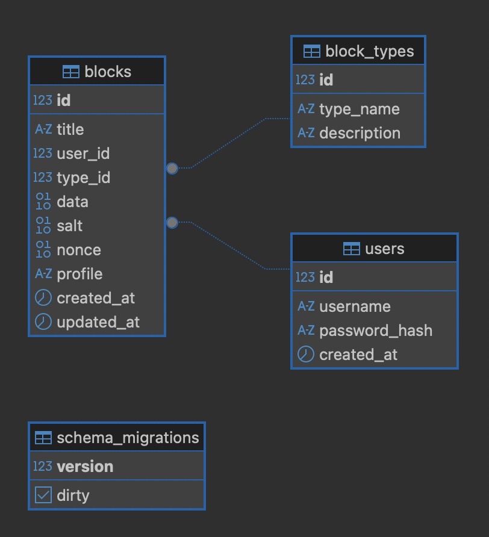

# go-ya-practicum-gophkeeper

#### Folder structure:
- **cmd**: apps entrypoint (client, server, migrator)
- **internal**: app code structured in a clean architechture style
- **migrations**: database schema  migrations

Client - a binary app providing CLI interface to communicate with server.<br/>
Server - binary app that implement server which host gRPC services for authenticating/registrating users, storing users' encrypted data.

## Use cases
- User registers/authenticates via client cli to access server API
- User stores encrypted data with password, sending it to server
- User access stored data by decrypting it via client with password set up during data block creating process.

Client's master password is not stored both on client or server side.
No generic password at all, client can set up block password separately.
Password which is entered by a client used to generate scrypt key to encrypt data.
Client can handle next data sets: raw text data, credentials (logo/pass), card info, binary data (file uploading, 10MB limit)
Encryption is simmetric with ability to TODO: select between 3 different profiles.
#### Avaliable encrypt options:
```
v1: N: 1<<14, P: 1, R:8 bytes, KeyLen: 32 bytes
v2: N: 1<<15, P: 1, R:8 bytes, KeyLen: 32 bytes
v3: N: 1<<16, P: 1, R:8 bytes, KeyLen: 32 bytes
```

### TODOs:
- cache encerypted data storage to disk.
- cache JWT token to restore session if it valid.
- add basic JWT claims (iat, exp, etc) to handle session.
- add build tags to compile client binary file for several platfroms:
```
- GOOS=darwin GOARCH=amd64 go build -o client-macos-amd64
- GOOS=darwin COARCH=arm64 go build -o client-macos-arm64
- GOOS=linux GOARCH=amd64 go build -o client-linux-amd64
- GOOS=windows GOARCH=amd64 go build -o client-windows-amd64.exe
```
- add documentation to server API and code.
- add build tags to set up. build date and client version.
- research server goroutines to implement graceful shutdown


### Physical datamodel

